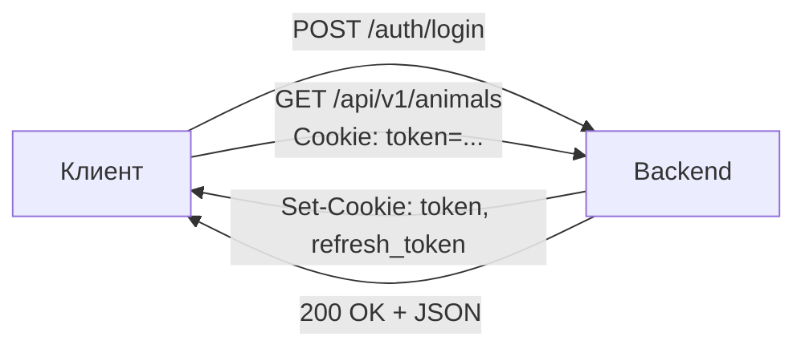

# API

## Обзор

Backend предоставляет REST API с префиксом `/api/v1`. Документация автоматически генерируется с помощью `utoipa` и доступна через Swagger UI по адресу `/api/v1/docs`.

## Аутентификация

Все запросы (кроме `/auth/login` и `/auth/register`) требуют действительного JWT-токена в cookie `token`.



## Формат ответов

### Успешный ответ (список)

```json
{
  "data": [...],
  "total": 150,
  "page": 1,
  "per_page": 20
}
```

### Успешный ответ (один объект)

```json
{
  "id": 42,
  "name": "Зорька",
  "life_number": "NL 123456789"
}
```

### Ошибка

```json
{
  "error": "Описание ошибки"
}
```

## Пагинация

Параметры запроса:

| Параметр | По умолчанию | Описание |
|----------|-------------|----------|
| `page` | 1 | Номер страницы |
| `per_page` | 20 | Записей на странице (макс. 100) |

## Эндпоинты

### Аутентификация

| Метод | Путь | Описание |
|-------|------|----------|
| POST | `/auth/login` | Вход в систему |
| POST | `/auth/register` | Регистрация (admin) |
| POST | `/auth/refresh` | Обновление токена |
| POST | `/auth/logout` | Выход (отзыв токена) |
| PUT | `/auth/password` | Смена пароля |

### Животные

| Метод | Путь | Описание |
|-------|------|----------|
| GET | `/animals` | Список животных (с фильтрами) |
| GET | `/animals/:id` | Карточка животного |
| POST | `/animals` | Создать животное |
| PUT | `/animals/:id` | Обновить животное |
| DELETE | `/animals/:id` | Деактивировать животное |
| GET | `/animals/stats` | Статистика по стаду |

### Надои

| Метод | Путь | Описание |
|-------|------|----------|
| GET | `/milk/day-productions` | Дневные надои |
| GET | `/milk/visits` | Визиты на доение |
| GET | `/milk/quality` | Качество молока |
| GET | `/milk/robot-data` | Данные робота |
| GET | `/milk/bulk-tank` | Данные танк-охладителя |

### Воспроизводство

| Метод | Путь | Описание |
|-------|------|----------|
| GET | `/reproduction/inseminations` | Список осеменений |
| GET | `/reproduction/pregnancies` | Список стельностей |
| GET | `/reproduction/calvings` | Список отёлов |
| GET | `/reproduction/heats` | Список охот |
| GET | `/reproduction/dry-offs` | Список запусков |

### Кормление

| Метод | Путь | Описание |
|-------|------|----------|
| GET | `/feed/day-amounts` | Дневное потребление |
| GET | `/feed/visits` | Визиты на кормление |

### Оповещения

| Метод | Путь | Описание |
|-------|------|----------|
| GET | `/alerts` | Список оповещений (с фильтрами) |
| GET | `/alerts/summary` | Сводка активных оповещений |
| PUT | `/alerts/:id/acknowledge` | Подтвердить оповещение |
| PUT | `/alerts/acknowledge-all` | Подтвердить все |

### Отчёты

| Метод | Путь | Описание |
|-------|------|----------|
| GET | `/reports/milk-production` | Отчёт по надоям |
| GET | `/reports/reproduction` | Отчёт по воспроизводству |
| GET | `/reports/feed` | Отчёт по кормлению |
| GET | `/reports/fitness` | Отчёт по здоровью |

### Настройки

| Метод | Путь | Описание |
|-------|------|----------|
| GET | `/settings` | Все настройки |
| PUT | `/settings` | Обновить настройки |
| GET | `/settings/alert-thresholds` | Пороги оповещений |
| PUT | `/settings/alert-thresholds` | Обновить пороги |

### Lely

| Метод | Путь | Описание |
|-------|------|----------|
| GET | `/lely/config` | Конфигурация интеграции |
| PUT | `/lely/config` | Обновить конфигурацию |
| POST | `/lely/sync` | Запустить синхронизацию |
| GET | `/lely/sync-state` | Состояние синхронизации |

### Health

| Метод | Путь | Описание |
|-------|------|----------|
| GET | `/healthz` | Проверка работоспособности |
| GET | `/readyz` | Проверка готовности |
| GET | `/stats` | Базовая статистика |
| GET | `/metrics` | Метрики Prometheus |
| GET | `/events` | Server-Sent Events (оповещения) |
