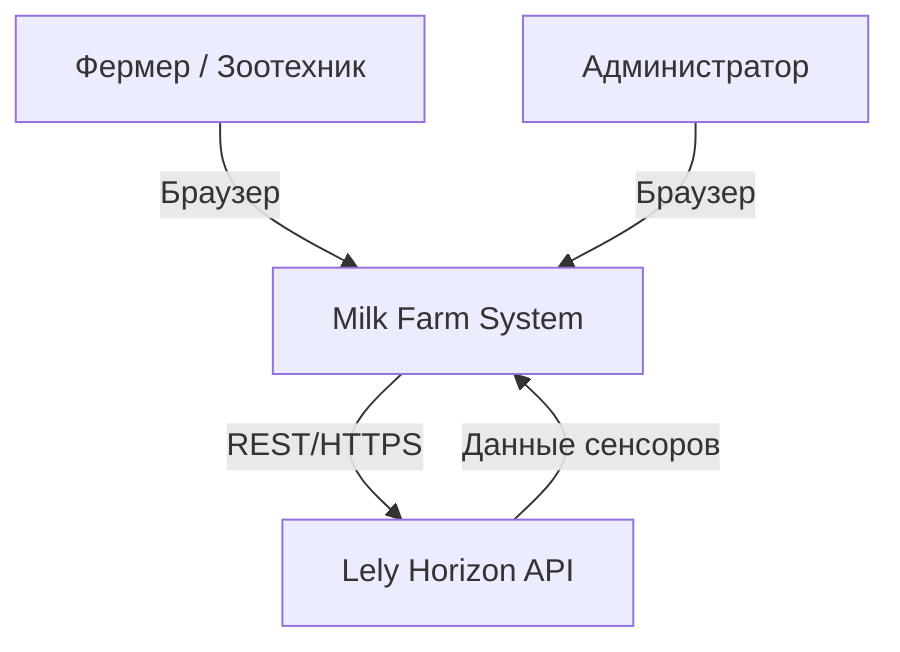
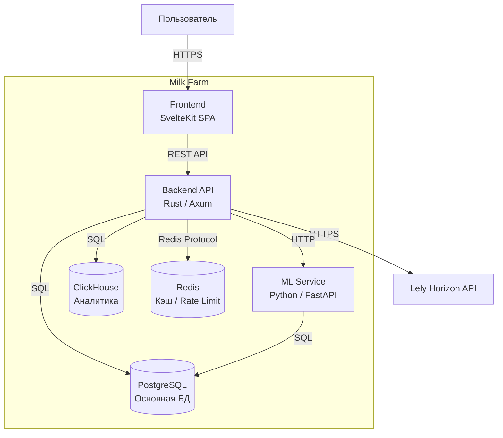
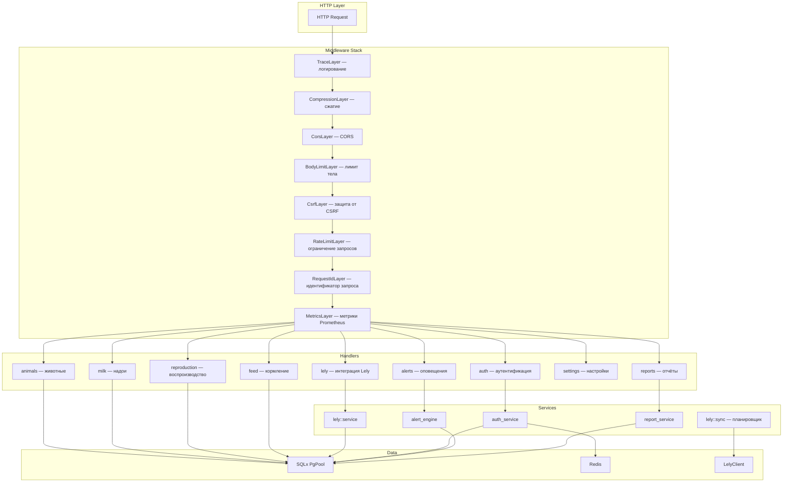
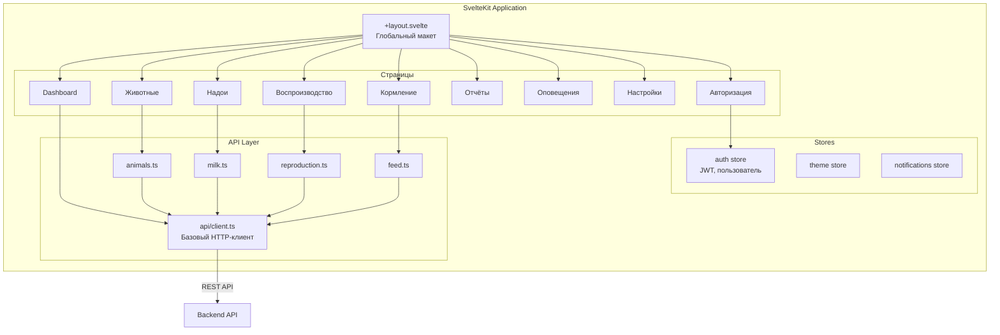
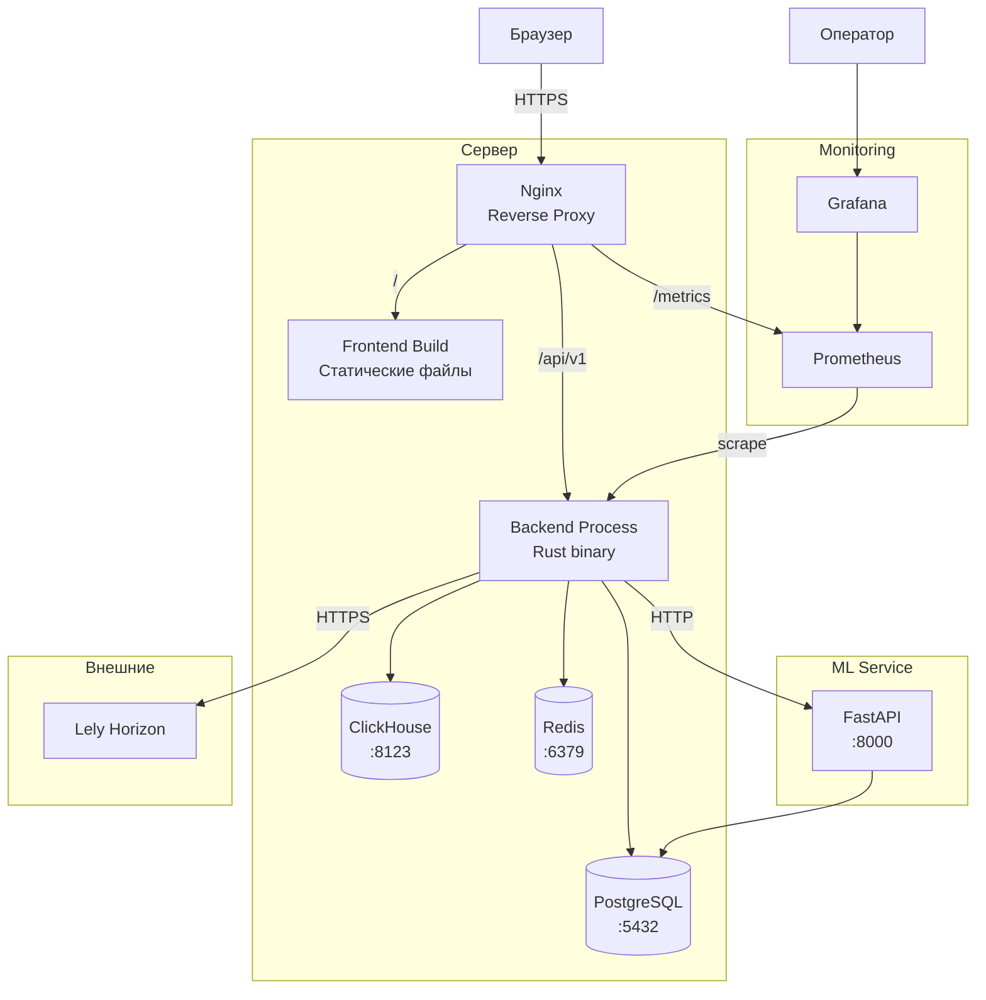
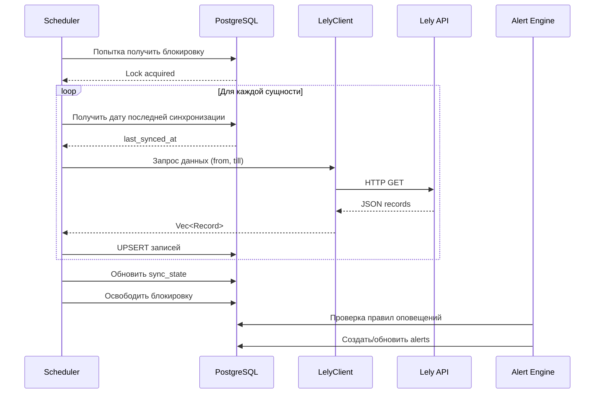
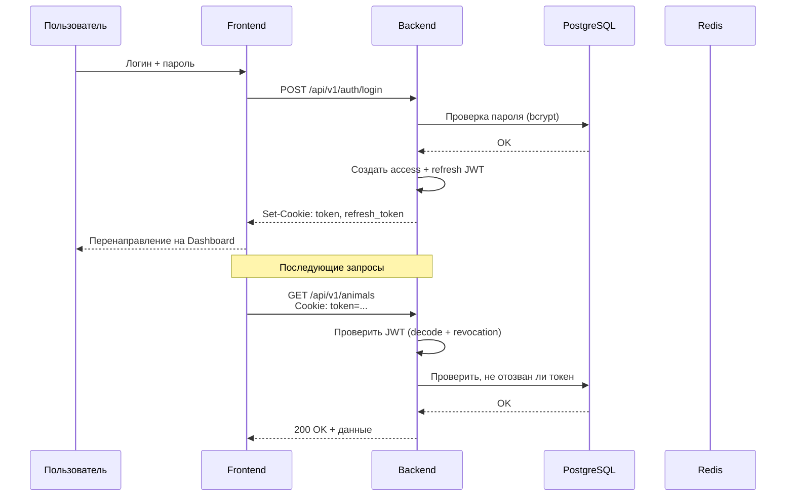

# Архитектура системы

## Контекст системы (System Context)

Система взаимодействует с двумя типами пользователей (через браузер) и внешней платформой Lely Horizon для получения данных с доильных роботов и датчиков.

## Контейнеры (Container Diagram)

## Компоненты Backend

## Компоненты Frontend

## Диаграмма развёртывания

## Потоки данных

### Синхронизация с Lely

### Аутентификация

## Принятые архитектурные решения

| Решение | Обоснование |
|---------|-------------|
| Rust для backend | Производительность, безопасность типов, минимальное потребление ресурсов |
| Axum | Асинхронный web-фреймворк, хорошо интегрируется с экосистемой Tower |
| SvelteKit для frontend | Компактный рантайм, отличная производительность, SSR из коробки |
| PostgreSQL | Надёжная реляционная СУБД, поддержка JSON, полнотекстовый поиск |
| ClickHouse | Колонковая СУБД для быстрых аналитических запросов по большим объёмам данных |
| Redis | Кэширование сессий, rate limiting, in-memory счётчики |
| JWT + HttpOnly cookies | Безопасная аутентификация без уязвимостей XSS |
