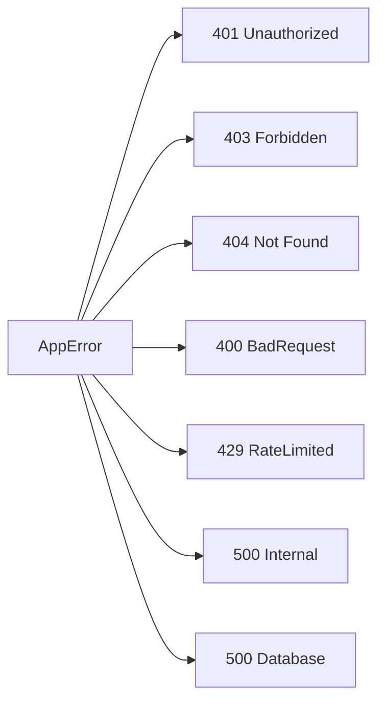
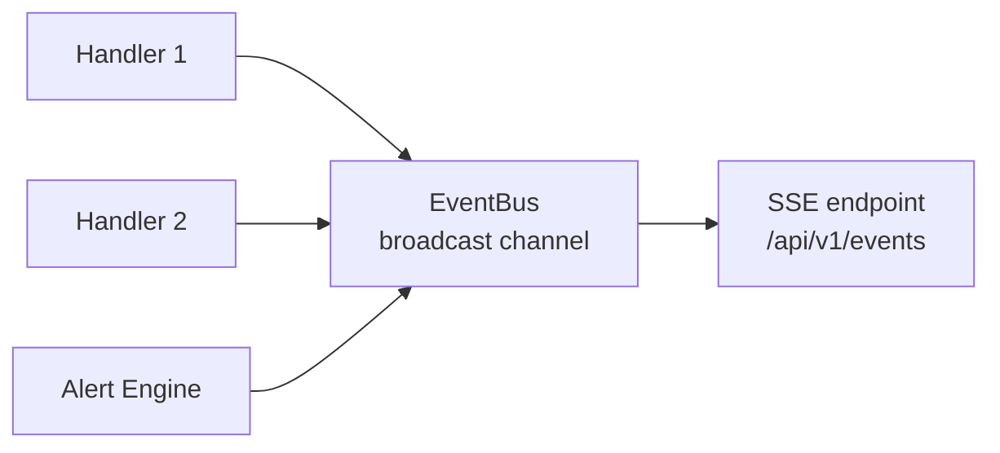

# Backend

Backend реализован на **Rust** с использованием web-фреймворка **Axum** и runtime **Tokio**.

## Структура модулей

```
backend/src/
├── lib.rs           # Создание приложения, middleware-стек
├── main.rs          # Точка входа, запуск сервера
├── config.rs        # Конфигурация (env, файлы)
├── state.rs         # AppState — разделяемое состояние
├── errors.rs        # Типы ошибок (AppError)
├── validation.rs    # Валидация входных данных
├── openapi.rs       # Спецификация OpenAPI
├── seed.rs          # Начальные данные
├── db/              # Подключение к БД
├── handlers/        # HTTP-обработчики (routes)
├── middleware/      # Промежуточное ПО
├── models/          # Модели данных
├── services/        # Бизнес-логика
├── lely/            # Интеграция с Lely Horizon
└── handlers/
    └── events.rs    # EventBus (Server-Sent Events)
```

## Основные зависимости

| Crate | Назначение |
|-------|-----------|
| `axum` | HTTP-фреймворк |
| `tokio` | Асинхронный runtime |
| `sqlx` | Асинхронный PostgreSQL драйвер |
| `serde` / `serde_json` | Сериализация/десериализация |
| `jsonwebtoken` | Создание и проверка JWT |
| `bcrypt` | Хеширование паролей |
| `utoipa` | Генерация OpenAPI-документации |
| `tower` / `tower-http` | Middleware (CORS, compression, tracing) |
| `prometheus` | Метрики |
| `redis` | Redis-клиент |
| `tracing` | Структурированное логирование |

## AppState

Разделяемое состояние приложения (`AppState`) содержит:

- `config: Config` — конфигурация из переменных окружения
- `pool: PgPool` — пул подключений к PostgreSQL
- `redis: Option<ConnectionManager>` — подключение к Redis (опционально)
- `lely: LelyState` — состояние интеграции с Lely

## Обработка ошибок

Все ошибки приводятся к типу `AppError`, который реализует `IntoResponse`:



## EventBus

Система использует in-process шину событий на основе **tokio::broadcast** для доставки оповещений клиенту через **Server-Sent Events (SSE)**:



## Маршрутизация

Все API-эндпоинты расположены под префиксом `/api/v1`:

| Группа | Префикс | Назначение |
|--------|---------|------------|
| Auth | `/auth` | Логин, регистрация, refresh, logout |
| Animals | `/animals` | CRUD животных |
| Milk | `/milk` | Надои, качество, визиты |
| Reproduction | `/reproduction` | Осеменения, стельности, отёлы |
| Feed | `/feed` | Кормление, рационы |
| Reports | `/reports` | Генерация отчётов |
| Alerts | `/alerts` | Оповещения |
| Settings | `/settings` | Настройки системы |
| Analytics | `/analytics` | Аналитические данные |
| Lely | `/lely` | Управление синхронизацией Lely |
| Health | `/healthz`, `/readyz` | Проверки работоспособности |
