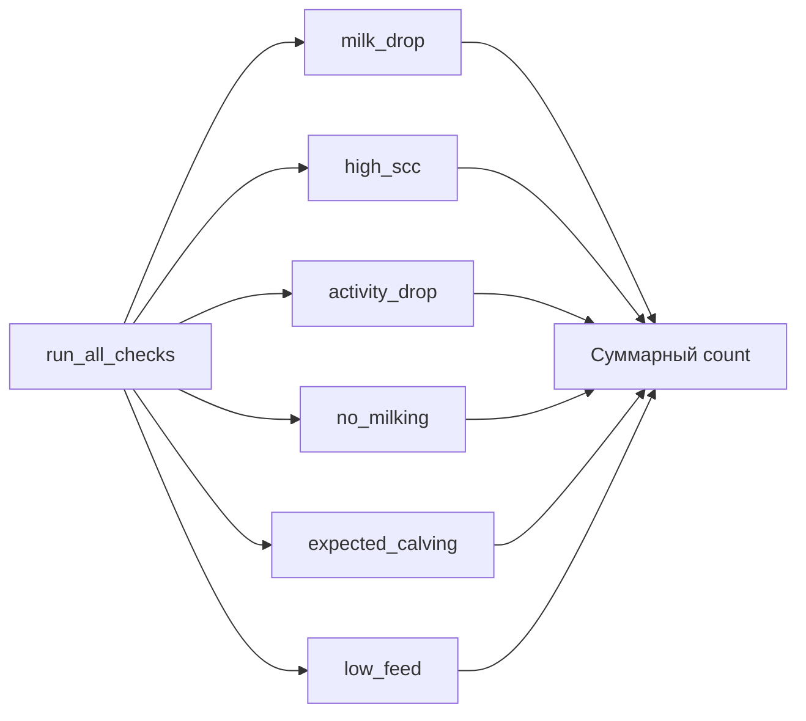
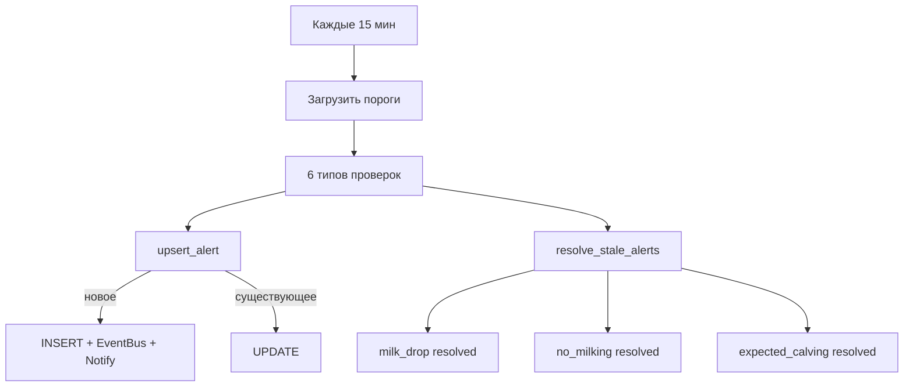

# Построчный разбор: Движок оповещений

В этой главе разбирается модуль `services/alert_engine.rs`, реализующий автоматическое выявление отклонений и создание оповещений.

## Основной цикл

Функция `run_alert_loop` запускается как фоновая задача:

```rust
{{#include ../../../backend/src/services/alert_engine.rs:11:32}}
```

- Работает с интервалом в 900 секунд (15 минут)
- В каждом цикле выполняет все проверки и разрешает устаревшие оповещения
- Логирует количество созданных оповещений

## Запуск всех проверок

```rust
{{#include ../../../backend/src/services/alert_engine.rs:34:48}}
```

Последовательно выполняются 6 типов проверок:



## Пороговые значения

```rust
{{#include ../../../backend/src/services/alert_engine.rs:50:77}}
```

Пороги загружаются из `system_settings` и имеют значения по умолчанию:

| Параметр | По умолчанию | Описание |
|----------|-------------|----------|
| `alert_min_milk` | 5.0 | Порог падения надоев (%) |
| `alert_max_scc` | 400.0 | Максимальный SCC |
| `alert_days_before_calving` | 14 | Дней до ожидаемого отёла |
| `alert_activity_drop_pct` | 30 | Порог падения активности (%) |

## Создание/обновление оповещения

```rust
{{#include ../../../backend/src/services/alert_engine.rs:79:139}}
```

Логика `upsert_alert`:
1. Ищет существующее активное оповещение с той же категорией и `animal_id`
2. Если найдено — обновляет сообщение, детали, важность
3. Если нет — создаёт новое
4. Публикует событие в EventBus (для SSE)
5. Отправляет уведомление через `notification_service`

## Проверка: падение надоев

```rust
{{#include ../../../backend/src/services/alert_engine.rs:141:179}}
```

Сравнивает средний надой за последние 2 дня с базовым средним за 14 дней. Если текущий надой ниже базового более чем на заданный процент — создаётся оповещение.

Severity: `critical` при падении >= 40%, иначе `warning`.

## Проверка: высокий SCC

```rust
{{#include ../../../backend/src/services/alert_engine.rs:181:217}}
```

Проверяет последнее значение SCC для каждого животного. Превышение порога указывает на возможный мастит.

Severity: `critical` при SCC > 500 000, иначе `warning`.

## Проверка: снижение активности

```rust
{{#include ../../../backend/src/services/alert_engine.rs:219:263}}
```

Сравнивает среднюю активность за последний день с базовым средним за 14 дней.

## Проверка: отсутствие доения

```rust
{{#include ../../../backend/src/services/alert_engine.rs:265:300}}
```

Выявляет коров, которые:
- Доились в последние 7 дней
- Не доились более 24 часов
- Не находятся в запуске

## Проверка: ожидаемый отёл

```rust
{{#include ../../../backend/src/services/alert_engine.rs:302:342}}
```

Находит стельных коров, у которых ожидаемая дата отёла (осеменение + 283 дня) наступает в течение заданного количества дней.

## Проверка: снижение потребления корма

```rust
{{#include ../../../backend/src/services/alert_engine.rs:344:381}}
```

Сравнивает среднее потребление корма за последние 2 дня с базовым за 14 дней. Порог — 20% снижение.

## Разрешение устаревших оповещений

```rust
{{#include ../../../backend/src/services/alert_engine.rs:383:430}}
```

Автоматически переводит оповещения в статус `resolved`, если условие, вызвавшее оповещение, больше не выполняется:
- `milk_drop` — надой восстановился
- `no_milking` — корова снова доится
- `expected_calving` — отёл произошёл

## Полный цикл оповещений


