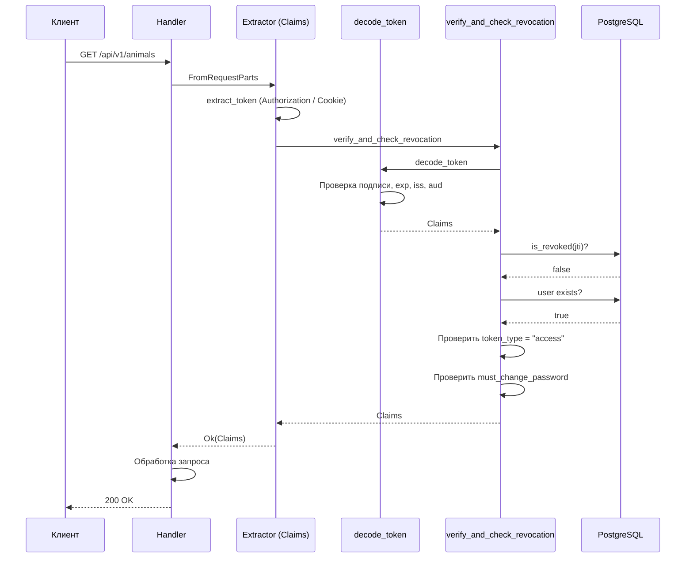

# Построчный разбор: Аутентификация JWT

В этой главе разбирается модуль `middleware/auth.rs`, реализующий аутентификацию на основе JWT-токенов.

## Структура Claims

JWT-токен содержит набор утверждений (claims), описывающих аутентифицированного пользователя:

```rust
{{#include ../../../backend/src/middleware/auth.rs:26:37}}
```

- `sub` — имя пользователя
- `role` — роль (admin, user, viewer)
- `must_change_password` — флаг обязательной смены пароля
- `exp` — время истечения (Unix timestamp)
- `jti` — уникальный идентификатор токена (для отзыва)
- `token_type` — тип токена (`access` или `refresh`)
- `iss` / `aud` — издатель и аудитория токена

## Декодирование и валидация токена

Функция `decode_token` проверяет подпись, срок действия, издателя и аудиторию:

```rust
{{#include ../../../backend/src/middleware/auth.rs:45:61}}
```

## Проверка отзыва и существования пользователя

После декодирования токен проверяется на отзыв (по `jti`) и на существование учётной записи:

```rust
{{#include ../../../backend/src/middleware/auth.rs:63:84}}
```

## Извлечение токена из запроса

Токен извлекается из заголовка `Authorization: Bearer ...` или из cookie `token`:

```rust
{{#include ../../../backend/src/middleware/auth.rs:167:173}}
```

```rust
{{#include ../../../backend/src/middleware/auth.rs:186:189}}
```

## Извлечение Claims из запроса

Тип `Claims` реализует `FromRequestParts` — Axum автоматически извлекает и проверяет токен:

```rust
{{#include ../../../backend/src/middleware/auth.rs:210:243}}
```

Порядок проверок:
1. Извлечение токена из заголовков
2. Декодирование и валидация JWT
3. Проверка отзыва в БД
4. Проверка типа токена (`access`)
5. Проверка `must_change_password`
6. В демо-режиме — возврат предустановленных claims

## ClaimsAllowMustChange

Вариант экстрактора, который разрешает доступ даже при `must_change_password=true` (нужен для эндпоинта смены пароля):

```rust
{{#include ../../../backend/src/middleware/auth.rs:86:110}}
```

## AdminGuard

Экстрактор, дополнительно проверяющий роль `admin`:

```rust
{{#include ../../../backend/src/middleware/auth.rs:245:276}}
```

## Создание токенов

### Access token

```rust
{{#include ../../../backend/src/middleware/auth.rs:112:136}}
```

### Refresh token

```rust
{{#include ../../../backend/src/middleware/auth.rs:138:161}}
```

Refresh token не содержит `must_change_password` и всегда имеет тип `refresh`.

## Валидация запросов

Модели `LoginRequest` и `RegisterRequest` содержат валидацию входных данных:

```rust
{{#include ../../../backend/src/middleware/auth.rs:278:304}}
```

## Полный поток аутентификации


