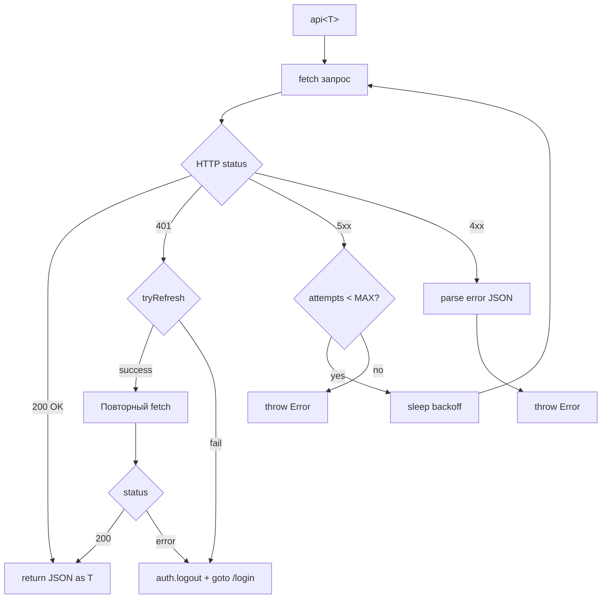

# Построчный разбор: Frontend API-клиент

В этой главе разбирается модуль `frontend/src/lib/api/client.ts` — центральный HTTP-клиент для взаимодействия с backend.

## Конфигурация и утилиты

```typescript
{{#include ../../../frontend/src/lib/api/client.ts:1:24}}
```

- `API_BASE` — базовый URL API (из переменной окружения или `/api/v1`)
- `MAX_RETRIES` — максимальное количество повторных попыток при 5xx
- `backoff` — exponential backoff с джиттером для retry
- `sleep` — утилита для задержки

## Обновление токена

Функция `tryRefresh` пытается обновить access token через refresh token, предотвращая множественные параллельные вызовы:

```typescript
{{#include ../../../frontend/src/lib/api/client.ts:26:46}}
```

- Использует `refreshingPromise` как мьютекс — только один refresh за раз
- При ошибке — возвращает `false`
- Refresh token отправляется через HttpOnly cookie (автоматически)

## Основная функция api\<T\>

```typescript
{{#include ../../../frontend/src/lib/api/client.ts:48:94}}
```

Поток выполнения:



Ключевые моменты:
- `credentials: 'include'` — передача HttpOnly cookies с каждым запросом
- При 401 — попытка обновить токен, затем повторный запрос
- При неудачном refresh — logout и перенаправление на страницу входа
- При 5xx — retry с exponential backoff (до `MAX_RETRIES`)
- При 4xx — немедленная ошибка с парсингом JSON

## Вспомогательные функции

```typescript
{{#include ../../../frontend/src/lib/api/client.ts:96:109}}
```

Типизированные обёртки для основных HTTP-методов:
- `del<T>(path)` — DELETE запрос
- `post<T>(path, body)` — POST запрос с телом
- `put<T>(path, body)` — PUT запрос с телом
- `buildQuery(obj)` — построение query-строки из объекта

## Интеграция со stores

API-клиент взаимодействует с `auth` store:
- `auth.logout()` — очистка состояния при истечении сессии
- `goto('/auth/login')` — перенаправление на страницу входа
