# Построчный разбор: Синхронизация Lely

В этой главе разбирается модуль `lely/sync.rs`, отвечающий за автоматическую синхронизацию данных с Lely Horizon.

## Запуск планировщика

Функция `start_sync_scheduler` запускает фоновую задачу, выполняющую синхронизацию через настраиваемый интервал:

```rust
{{#include ../../../backend/src/lely/sync.rs:13:46}}
```

- Читает конфигурацию для получения `sync_interval_secs`
- Подписывается на cancellation token для корректной остановки
- В каждом цикле вызывает `run_sync`, обновляя метрики в случае успеха или ошибки

## Точка входа синхронизации

```rust
{{#include ../../../backend/src/lely/sync.rs:48:66}}
```

1. Проверяет, включена ли интеграция в конфигурации
2. Пытается получить advisory lock в PostgreSQL (предотвращает параллельный запуск)
3. Выполняет основную синхронизацию
4. Освобождает блокировку

## Макрос try_sync

Макрос для продолжения синхронизации при ошибке отдельной сущности:

```rust
{{#include ../../../backend/src/lely/sync.rs:68:74}}
```

## Основной цикл синхронизации

```rust
{{#include ../../../backend/src/lely/sync.rs:76:302}}
```

`run_sync_inner` последовательно синхронизирует все сущности:

1. **Простые сущности** (animals, sires) — полная загрузка
2. **Чанковые сущности** (надои, кормление, активность) — по временным окнам
3. **Специальные сущности** (grazing, bloodlines, feed_types, feed_groups, contacts, locations)

### Порядок синхронизации

```mermaid
flowchart TD
    A[animals] --> CACHE[AnimalCache.load]
    CACHE --> MDP[milk_day_productions<br/>окно: 10 дней]
    MDP --> MV[milk_visits<br/>окно: 7 дней]
    MV --> MVQ[milk_visit_quality<br/>окно: 1 день]
    MVQ --> MDQ[milk_day_quality<br/>окно: 1 день]
    MDQ --> RMD[robot_milk_data<br/>окно: 7 дней]
    RMD --> FDA[feed_day_amounts<br/>окно: 7 дней]
    FDA --> FV[feed_visits<br/>окно: 3 дня]
    FV --> ACT[activities<br/>окно: 1 день]
    ACT --> RUM[ruminations<br/>окно: 2 дня]
    RUM --> GRAZ[grazing_data<br/>специальный алгоритм]
    GRAZ --> CALV[calvings<br/>окно: 90 дней]
    CALV --> INS[inseminations<br/>окно: 90 дней]
    INS --> PREG[pregnancies<br/>окно: 90 дней]
    PREG --> HEAT[heats<br/>окно: 90 дней]
    HEAT --> DRY[dry_offs<br/>окно: 90 дней]
    DRY --> SIRES[sires]
    SIRES --> TRANS[transfers<br/>окно: 90 дней]
    TRANS --> BL[bloodlines<br/>потоковый]
    BL --> FT[feed_types]
    FT --> FG[feed_groups]
    FG --> CT[contacts]
    CT --> LOC[locations]
```



## sync_simple

Синхронизация без разбиения на временные интервалы:

```rust
{{#include ../../../backend/src/lely/sync.rs:304:323}}
```

Выполняет переданный future, обновляет `sync_state` с результатом.

## sync_chunked

Инкрементальная синхронизация по временным окнам:

```rust
{{#include ../../../backend/src/lely/sync.rs:325:372}}
```

1. Получает дату последней синхронизации из `sync_state`
2. Если нет — начинает с 30 дней назад
3. Разбивает период на чанки размером `max_days`
4. Для каждого чанка вызывает функцию синхронизации
5. При ошибке — записывает её и прерывает

## sync_grazing

Специальная синхронизация пастбищных данных с начала текущего года:

```rust
{{#include ../../../backend/src/lely/sync.rs:374:419}}
```

## sync_bloodlines

Потоковая синхронизация родословных (10 параллельных запросов):

```rust
{{#include ../../../backend/src/lely/sync.rs:421:454}}
```

- Собирает все `life_number` из `AnimalCache`
- Создаёт поток с `buffer_unordered(10)` для параллельной обработки
- Ошибки отдельных запросов логируются, но не прерывают процесс
