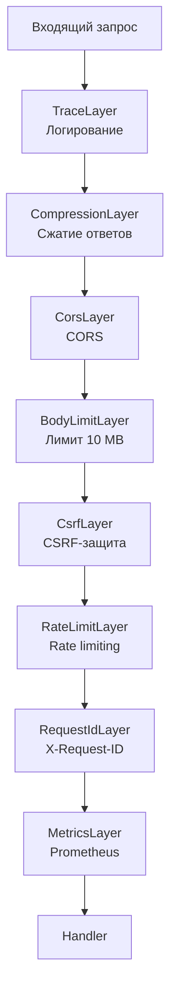

# Построчный разбор: Стек Middleware

В этой главе разбирается состав и порядок применения middleware в приложении.

## Регистрация модулей

```rust
{{#include ../../../backend/src/middleware/mod.rs:1:5}}
```

Middleware организованы в отдельные модули: аутентификация, CSRF, метрики, rate limiting, идентификаторы запросов.

## Сборка стека middleware

Функция `create_app` в `lib.rs` собирает Router и накладывает middleware-стек в определённом порядке:

```rust
{{#include ../../../backend/src/lib.rs:45:96}}
```

Порядок наложения слоёв (снизу вверх — от внешнего к внутреннему):

1. **TraceLayer** — логирование HTTP-запросов/ответов
2. **CompressionLayer** — сжатие ответов (gzip/brotli)
3. **CorsLayer** — обработка CORS
4. **BodyLimitLayer** — ограничение размера тела запроса (10 MB)
5. **CsrfLayer** — защита от CSRF для state-changing запросов
6. **RateLimitLayer** — ограничение частоты запросов
7. **RequestIdLayer** — присвоение идентификатора запроса
8. **MetricsLayer** — сбор метрик Prometheus



## RequestIdLayer

Присваивает каждому запросу уникальный идентификатор:

```rust
{{#include ../../../backend/src/middleware/request_id.rs:51:65}}
```

- Проверяет заголовок `X-Request-ID` от клиента
- Если отсутствует — генерирует UUID
- Добавляет `x-request-id` в заголовки запроса и ответа

## MetricsLayer

Собирает метрики Prometheus для каждого HTTP-запроса:

```rust
{{#include ../../../backend/src/middleware/metrics.rs:168:196}}
```

- Нормализует путь (группирует по шаблонам маршрутов)
- Замеряет длительность обработки
- Увеличивает счётчик по method/route/status
- Записывает гистограмму длительности

### Определение метрик

```rust
{{#include ../../../backend/src/middleware/metrics.rs:14:68}}
```

Доступные метрики: `http_requests_total`, `http_request_duration_seconds`, `rate_limit_rejections_total`, `auth_events_total`, `lely_sync_total`, `db_pool_size`, `db_pool_idle`.

## RateLimitLayer

Ограничивает частоту запросов по IP-адресу клиента:

```rust
{{#include ../../../backend/src/middleware/rate_limit.rs:175:204}}
```

### RateLimiter — проверка через Redis

```rust
{{#include ../../../backend/src/middleware/rate_limit.rs:40:70}}
```

Атомарный `INCR` + `EXPIRE` обеспечивает точный подсчёт в распределённой среде.

### RateLimiter — fallback в памяти

```rust
{{#include ../../../backend/src/middleware/rate_limit.rs:72:96}}
```

При недоступности Redis используется in-memory HashMap с автоматической очисткой устаревших записей.

### Извлечение IP клиента

```rust
{{#include ../../../backend/src/middleware/rate_limit.rs:99:120}}
```

Поддержка `X-Forwarded-For` и `X-Real-IP` при включённом `trust_proxy`.

## CsrfLayer

Проверяет заголовок `Origin` для state-changing запросов:

```rust
{{#include ../../../backend/src/middleware/csrf.rs:96:113}}
```

- Только POST, PUT, DELETE, PATCH проверяются
- `Origin` сопоставляется со списком разрешённых (`cors_origins`)
- Отсутствие `Origin` допускается (для API-клиентов)

### Валидация Origin

```rust
{{#include ../../../backend/src/middleware/csrf.rs:21:35}}
```
