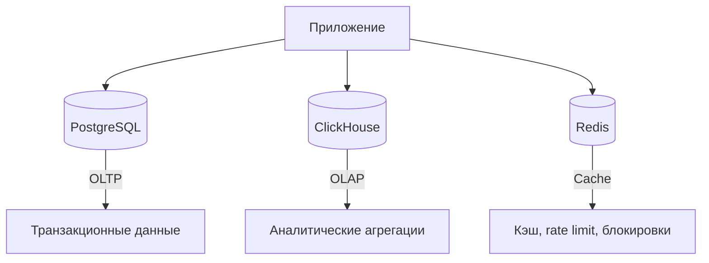

# База данных

## Обзор

Система использует три типа хранилищ:



## PostgreSQL

Основное хранилище всех данных системы. Используется для OLTP-нагрузки.

### ER-диаграмма

```mermaid
erDiagram
    users {
        int id PK
        varchar username UK
        varchar password_hash
        varchar role
        boolean must_change_password
        timestamp created_at
    }

    animals {
        int id PK
        varchar life_number UK
        varchar name
        varchar gender
        date birth_date
        varchar breed
        boolean active
        int farm_id FK
    }

    milk_day_productions {
        bigint id PK
        int animal_id FK
        date date
        float8 milk_amount
        varchar source
    }

    milk_quality {
        bigint id PK
        int animal_id FK
        date date
        float8 fat
        float8 protein
        float8 lactose
        float8 scc
    }

    milk_visits {
        bigint id PK
        int animal_id FK
        timestamp visit_datetime
        float8 milk_amount
        varchar device_serial
    }

    inseminations {
        int id PK
        int animal_id FK
        date date
        int sire_id FK
        varchar technician
    }

    pregnancies {
        int id PK
        int animal_id FK
        int insemination_id FK
        date check_date
        boolean result
    }

    calvings {
        int id PK
        int animal_id FK
        date date
        varchar calf_gender
        varchar complications
    }

    heats {
        int id PK
        int animal_id FK
        date date
        float8 score
    }

    dry_offs {
        int id PK
        int animal_id FK
        date date
        varchar reason
    }

    feed_day_amounts {
        bigint id PK
        int animal_id FK
        date feed_date
        float8 total
        varchar source
    }

    activities {
        bigint id PK
        int animal_id FK
        timestamp activity_datetime
        int activity_counter
    }

    alerts {
        int id PK
        varchar category
        varchar severity
        varchar status
        int animal_id FK
        text message
        jsonb details
        timestamp detected_at
        timestamp acknowledged_at
        timestamp resolved_at
    }

    system_settings {
        varchar key PK
        text value
    }

    sync_state {
        varchar entity_name PK
        varchar status
        int total_synced
        timestamp last_synced_at
        text last_error
    }

    animals ||--o{ milk_day_productions : "надои"
    animals ||--o{ milk_quality : "качество"
    animals ||--o{ milk_visits : "визиты"
    animals ||--o{ inseminations : "осеменения"
    animals ||--o{ pregnancies : "стельности"
    animals ||--o{ calvings : "отёлы"
    animals ||--o{ heats : "охоты"
    animals ||--o{ dry_offs : "запуски"
    animals ||--o{ feed_day_amounts : "кормление"
    animals ||--o{ activities : "активность"
    animals ||--o{ alerts : "оповещения"
```



### Основные таблицы

| Таблица | Назначение |
|---------|------------|
| `users` | Пользователи системы (аутентификация) |
| `animals` | Реестр животных |
| `milk_day_productions` | Дневные надои |
| `milk_quality` | Показатели качества молока |
| `milk_visits` | Визиты на доильную установку |
| `inseminations` | Записи осеменений |
| `pregnancies` | Результаты проверок на стельность |
| `calvings` | Записи отёлов |
| `heats` | События охоты |
| `dry_offs` | Записи запуска (прекращение доения) |
| `feed_day_amounts` | Дневное потребление корма |
| `activities` | Показатели активности (датчики Lely) |
| `alerts` | Система оповещений |
| `system_settings` | Настройки системы (key-value) |
| `sync_state` | Состояние синхронизации с Lely |
| `token_revocations` | Отозванные JWT-токены |

### Enum-типы

```sql
-- Категории оповещений
alert_category := 'milk_drop' | 'high_scc' | 'activity_drop' | 'low_feed' 
                | 'no_milking' | 'ketosis_risk' | 'mastitis_risk' 
                | 'expected_calving' | 'equipment_anomaly' | 'other'

-- Важность
alert_severity := 'critical' | 'warning' | 'info'

-- Статус
alert_status := 'active' | 'acknowledged' | 'resolved'
```

## ClickHouse

ClickHouse используется для аналитических запросов по историческим данным. Позволяет выполнять быстрые агрегации по большим объёмам записей надоев, кормления, активности без нагрузки на основную БД.

### Применение

- Агрегированные отчёты за длительные периоды
- Расчёт средних значений по группам животных
- Аналитика трендов надоев, кормления, воспроизводства

## Redis

Redis выполняет вспомогательные функции:

| Функция | Ключ | Описание |
|---------|------|----------|
| Rate limiting | `rl:{ip}` | Счётчик запросов с TTL |
| Отзыв токенов | Кэш проверок | Ускорение проверки `token_revocations` |
| Блокировка синхронизации | `lely_sync_lock` | Предотвращение параллельных запусков синхронизации |
