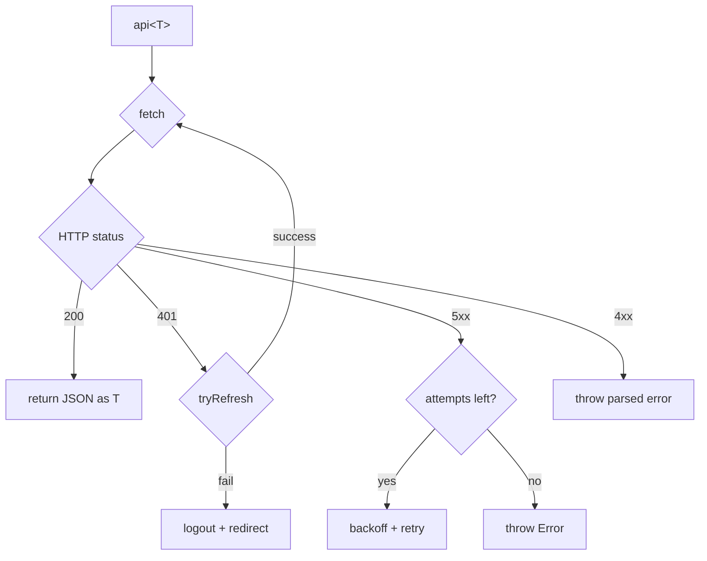

# Frontend

Frontend реализован на **SvelteKit** с **TypeScript** и **Tailwind CSS**.

## Структура

```
frontend/src/
├── routes/              # Страницы (SvelteKit file-based routing)
│   ├── +layout.svelte   # Общий макет (sidebar, header)
│   ├── +page.svelte     # Dashboard
│   ├── auth/
│   │   └── login/       # Страница входа
│   ├── animals/         # Реестр животных
│   ├── milk/            # Надои
│   ├── reproduction/    # Воспроизводство
│   ├── feed/            # Кормление
│   ├── reports/         # Отчёты
│   ├── alerts/          # Оповещения
│   └── settings/        # Настройки
├── lib/
│   ├── api/             # API-клиент и типизированные обёртки
│   │   ├── client.ts    # Базовый HTTP-клиент с retry и refresh
│   │   ├── animals.ts   # API животных
│   │   ├── milk.ts      # API надоев
│   │   └── ...
│   ├── stores/          # Svelte stores
│   │   ├── auth.ts      # Состояние аутентификации
│   │   └── theme.ts     # Тема оформления
│   ├── components/      # Переиспользуемые компоненты
│   └── utils/           # Утилиты
└── app.html             # HTML-шаблон
```

## API-клиент

Центральный модуль `lib/api/client.ts` обеспечивает:

- **Автоматический retry** с exponential backoff для серверных ошибок (5xx)
- **Обновление токена** — при 401 автоматически пытается обновить access token через refresh token
- **Типизация** — все ответы типизированы через дженерики
- **Унифицированная обработка ошибок**



## Состояние аутентификации

Store `auth` управляет состоянием текущего пользователя:

- Хранит JWT-токены в **HttpOnly cookies** (устанавливаются сервером)
- Предоставляет реактивные данные о пользователе (`$auth.user`, `$auth.isAdmin`)
- Обрабатывает logout с очисткой состояния

## Основные страницы

| Страница | Маршрут | Назначение |
|----------|---------|------------|
| Dashboard | `/` | Обзор ключевых метрик фермы |
| Животные | `/animals` | Реестр с фильтрацией и пагинацией |
| Карточка животного | `/animals/[id]` | Подробная информация, история |
| Надои | `/milk` | Таблица надоев, графики |
| Воспроизводство | `/reproduction` | Календарь, события |
| Кормление | `/feed` | Рационы, потребление |
| Отчёты | `/reports` | Генерация и просмотр отчётов |
| Оповещения | `/alerts` | Список активных оповещений |
| Настройки | `/settings` | Конфигурация системы |

## UI-компоненты

Используются переиспользуемые Svelte-компоненты:

- **Таблицы** — с сортировкой, фильтрацией, пагинацией
- **Графики** — интеграция с Chart.js для визуализации данных
- **Формы** — валидация на стороне клиента
- **Модальные окна** — подтверждение действий
- **Toast-уведомления** — обратная связь с пользователем
