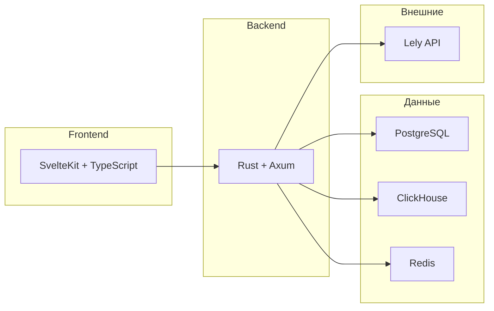

# Введение

**Milk Farm** — информационная система для управления молочной фермой, интегрированная с оборудованием Lely (роботизированные доильные установки, кормовые станции, датчики активности).

## Назначение

Система решает следующие задачи:

- **Учёт поголовья** — ведение реестра животных с привязкой к данных Lely (生命周期: отёл, осеменение, запуск, выбытие)
- **Мониторинг надоев** — автоматический сбор данных о надоях, качестве молока, посещениях доильного робота
- **Кормление** — контроль рационов, потребления корма, работы кормовых станций
- **Воспроизводство** — отслеживание охоты, осеменений, стельностей, ожидаемых отёлов
- **Аналитика и отчёты** — агрегированные отчёты по производству, здоровью, воспроизводству
- **Система оповещений** — автоматическое выявление отклонений (падение надоев, высокий SCC, снижение активности) и уведомление персонала

## Технологический стек



| Слой | Технология | Назначение |
|------|-----------|------------|
| Frontend | SvelteKit, TypeScript, Tailwind CSS | Пользовательский интерфейс |
| Backend | Rust, Axum, SQLx, Tokio | REST API, бизнес-логика |
| БД основная | PostgreSQL | Основное хранилище данных |
| Аналитика | ClickHouse | Аналитические запросы, агрегации |
| Кэш | Redis | Кэширование, rate limiting, сессии |
| ML | Python (FastAPI) | ML-модели для прогнозов |
| Мониторинг | Prometheus + Grafana | Метрики, дашборды |

## Структура проекта

```
milk-farm/
├── backend/          # Rust-бэкенд (Axum)
│   └── src/
│       ├── handlers/   # HTTP-обработчики
│       ├── middleware/  # Промежуточное ПО
│       ├── services/    # Бизнес-логика
│       ├── models/      # Модели данных
│       ├── lely/        # Интеграция с Lely
│       └── db/          # Миграции
├── frontend/         # SvelteKit-фронтенд
│   └── src/
│       ├── routes/      # Страницы
│       ├── lib/
│       │   ├── api/       # API-клиент
│       │   ├── stores/    # Svelte stores
│       │   └── components/ # Компоненты
│       └── ...
├── ml/               # ML-сервис (Python)
├── docs/
│   ├── book/           # Документация (mdBook)
│   └── sql/            # SQL-миграции
└── docker-compose.yml
```
