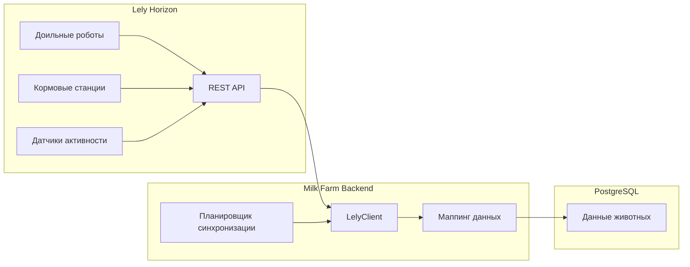
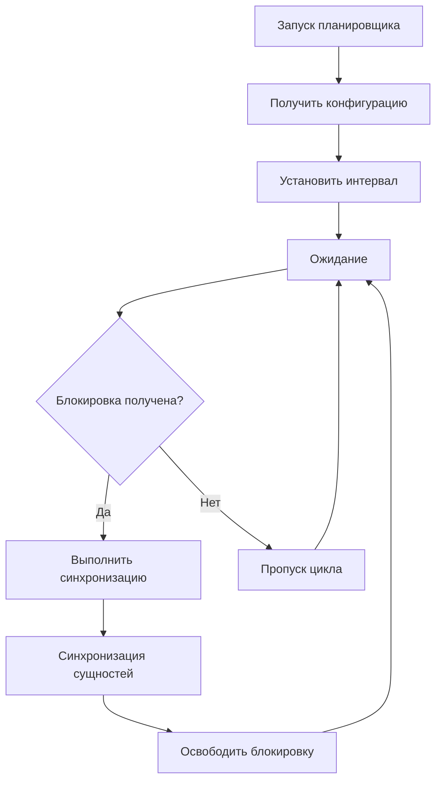
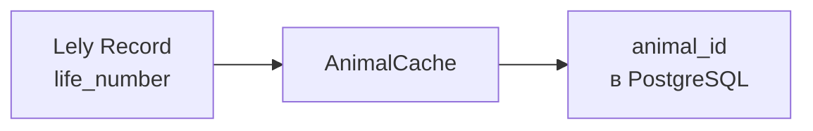

# Интеграция с Lely

## Обзор

Интеграция с **Lely Horizon** обеспечивает автоматический импорт данных с роботизированного оборудования фермы:

## LelyClient

HTTP-клиент для взаимодействия с Lely Horizon API:

- Аутентификация по API-ключу (Bearer token)
- Получение данных по временным диапазонам
- Автоматический retry при ошибках

## Планировщик синхронизации

Синхронизация запускается автоматически через настраиваемый интервал:

### Блокировка синхронизации

Для предотвращения параллельного запуска используется advisory lock в PostgreSQL (`try_acquire_lock` / `release_lock`). Это гарантирует, что только один экземпляр выполняет синхронизацию.

## Синхронизируемые сущности

### Простые сущности (полная синхронизация)

| Сущность | Описание |
|----------|----------|
| `animals` | Реестр животных |
| `sires` | Производители |
| `feed_types` | Типы кормов |
| `feed_groups` | Группы кормов |
| `contacts` | Контакты |
| `locations` | Локации |

### Чанковые сущности (по временным диапазонам)

| Сущность | Окно (дней) | Описание |
|----------|------------|----------|
| `milk_day_productions` | 10 | Дневные надои |
| `milk_visits` | 7 | Визиты на доение |
| `milk_visit_quality` | 1 | Качество по визитам |
| `milk_day_productions_quality` | 1 | Качество по дням |
| `robot_milk_data` | 7 | Данные доильного робота |
| `feed_day_amounts` | 7 | Потребление корма |
| `feed_visits` | 3 | Визиты на кормление |
| `activities` | 1 | Активность |
| `ruminations` | 2 | Жвачка |
| `grazing_data` | 90 | Пастбищные данные |
| `calvings` | 90 | Отёлы |
| `inseminations` | 90 | Осеменения |
| `pregnancies` | 90 | Стельности |
| `heats` | 90 | Охоты |
| `dry_offs` | 90 | Запуски |
| `transfers` | 90 | Перемещения |

### Специальные сущности

| Сущность | Режим | Описание |
|----------|-------|----------|
| `bloodlines` | Потоковый (10 параллельных) | Родословные по каждому животному |
| `grazing_data` | Чанковый с начала года | Данные пастбищ |

## Маппинг данных

`AnimalCache` загружается перед синхронизацией и используется для связывания записей Lely (по `life_number`) с внутренними ID животных:

## Состояние синхронизации

Таблица `sync_state` отслеживает статус каждой сущности:

| Поле | Описание |
|------|----------|
| `entity_name` | Название сущности |
| `status` | `success` или `error` |
| `total_synced` | Количество обработанных записей |
| `last_synced_at` | Время последней успешной синхронизации |
| `last_error` | Текст последней ошибки |

На основе `last_synced_at` определяется начальная дата для следующей инкрементальной синхронизации.
