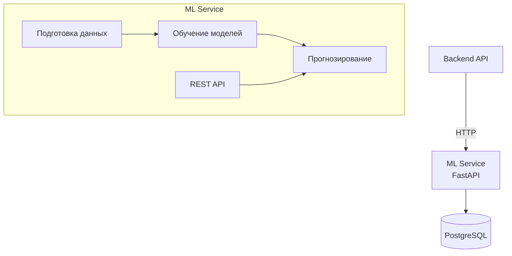
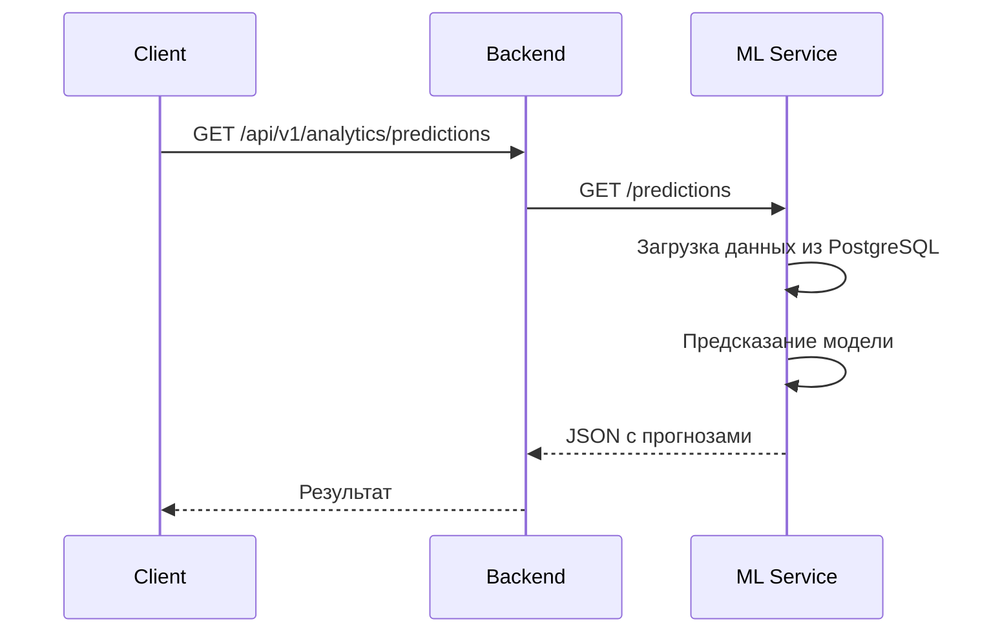

# ML и аналитика

## Обзор

ML-сервис реализован на Python (FastAPI) и предоставляет прогностические модели для анализа данных фермы.

## Задачи ML

### Прогноз надоев

Модель прогнозирует ожидаемый надой для каждого животного на основе:

- Исторических данных о надоях
- Дня лактации
- Возраста животного
- Сезонных факторов

### Риск заболеваний

Выявление животных с повышенным риском:

- **Мастит** — на основе SCC, надоя, температуры
- **Кетоз** — на основе надоя, потребления корма, активности
- **Хромота** — на основе активности

### Оптимальное время осеменения

Рекомендации по оптимальному времени осеменения на основе:

- Данных об активности (охота)
- Истории воспроизводства
- Дня лактации

## Интеграция с Backend

Backend обращается к ML-сервису через HTTP API:

## Хранение моделей

Обученные модели хранятся в файловой системе ML-сервиса и автоматически загружаются при старте. Переобучение выполняется по расписанию с использованием свежих данных из PostgreSQL.
