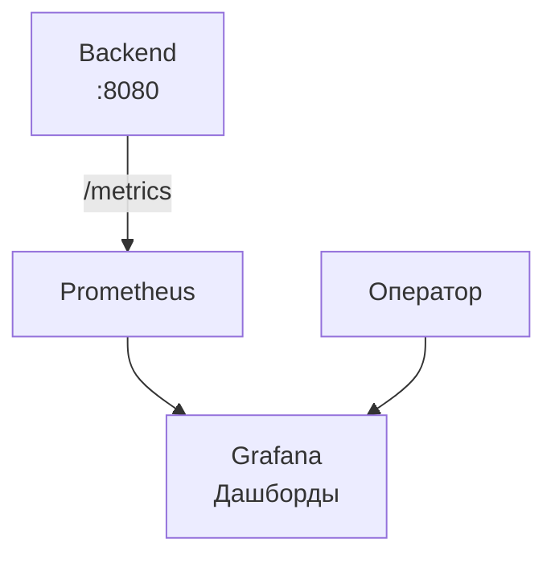
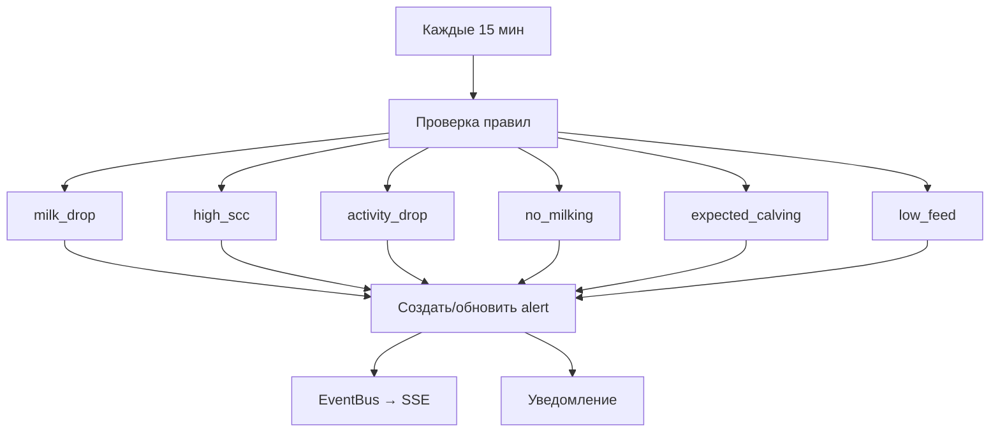

# Мониторинг

## Обзор

Система мониторинга построена на базе **Prometheus** и **Grafana**.

## Метрики

Backend собирает метрики с помощью crate `prometheus` и отдаёт их на эндпоинте `/metrics`.

### HTTP-метрики

| Метрика | Тип | Лейблы | Описание |
|---------|-----|--------|----------|
| `http_requests_total` | Counter | method, route, status | Общее количество HTTP-запросов |
| `http_request_duration_seconds` | Histogram | method, route | Длительность HTTP-запросов |

### Rate Limiting

| Метрика | Тип | Лейблы | Описание |
|---------|-----|--------|----------|
| `rate_limit_rejections_total` | Counter | ip | Отклонённые запросы |

### Аутентификация

| Метрика | Тип | Лейблы | Описание |
|---------|-----|--------|----------|
| `auth_events_total` | Counter | event | События аутентификации |

### Синхронизация Lely

| Метрика | Тип | Лейблы | Описание |
|---------|-----|--------|----------|
| `lely_sync_total` | Counter | status | Попытки синхронизации |

### База данных

| Метрика | Тип | Описание |
|---------|-----|----------|
| `db_pool_size` | Gauge | Размер пула подключений |
| `db_pool_idle` | Gauge | Свободные подключения |

## Логирование

Backend использует crate `tracing` для структурированного логирования:

- **Уровни**: error, warn, info, debug, trace
- **Формат**: структурированный JSON (в production)
- **Контекст**: request_id добавляется в каждый лог через middleware

## Health Checks

| Эндпоинт | Назначение |
|----------|------------|
| `GET /healthz` | Проверка, что процесс жив |
| `GET /readyz` | Проверка готовности (БД, Redis) |

## Alert Engine

Автоматическая система оповещений (не связана с Prometheus alerting) работает как фоновая задача в backend:

Подробнее о работе alert engine — в главе [Построчный разбор: Alert Engine](./code-alerts.md).
