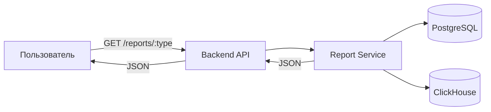

# Отчёты

## Обзор

Система предоставляет набор отчётов для анализа работы фермы. Отчёты генерируются на основе данных, хранящихся в PostgreSQL и ClickHouse.

## Типы отчётов

### Отчёт по надоям

Содержит агрегированные данные о производстве молока:

- Дневные/недельные/месячные надои по животным и группам
- Средние показатели по стаду
- Сравнение с предыдущими периодами
- Тренды качества (жир, белок, SCC)

### Отчёт по воспроизводству

Показатели воспроизводительной функции стада:

- Процент осеменений, приведших к стельности
- Средний интервал от отёла до первого осеменения
- Количество открытых дней (days open)
- Статус воспроизводства по каждому животному

### Отчёт по кормлению

Данные о потреблении корма:

- Потребление по животным и группам
- Сравнение с целевыми показателями рациона
- Тренды потребления
- Эффективность конверсии корма

### Отчёт по здоровью

Комплексная оценка здоровья животных:

- Активность (по данным датчиков)
- Жвачка
- Падение надоев
- Показатели SCC
- Связанные оповещения

## Параметры отчётов

Все отчёты поддерживают фильтрацию:

| Параметр | Описание |
|----------|----------|
| `from` | Начальная дата |
| `to` | Конечная дата |
| `animal_id` | Конкретное животное |
| `group` | Группа животных |

## Формат данных

Отчёты возвращаются в формате JSON с готовыми агрегациями для отображения на frontend в виде таблиц и графиков.
