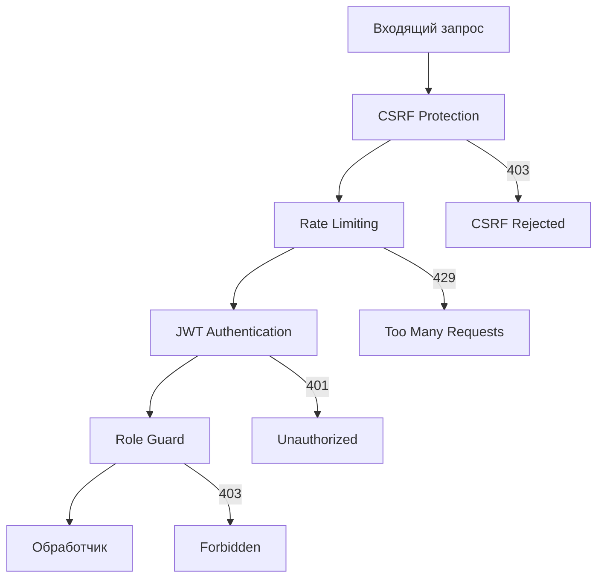
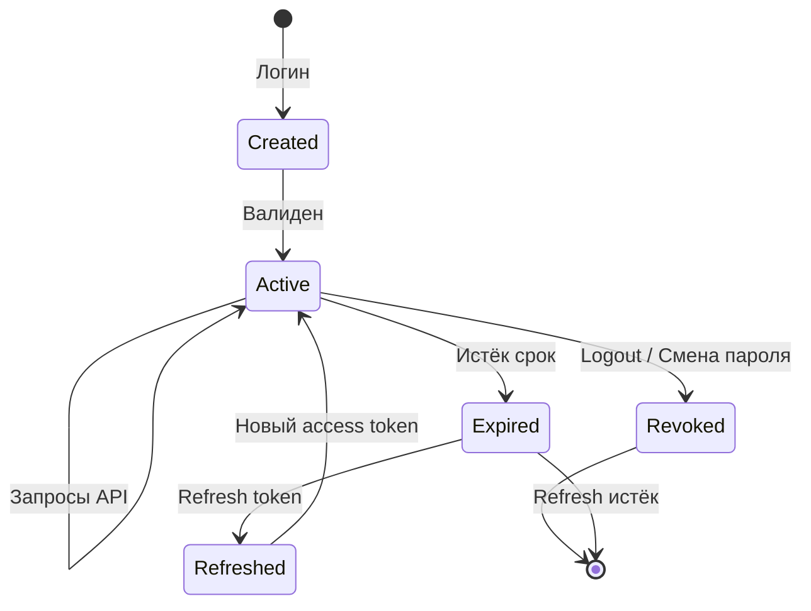

# Безопасность

## Обзор мер безопасности



## Аутентификация (JWT)

Система использует двухтокенную схему на основе JWT:

| Токен | Хранение | Срок действия | Назначение |
|-------|----------|---------------|------------|
| Access token | HttpOnly cookie `token` | Короткий (настраивается) | Авторизация запросов |
| Refresh token | HttpOnly cookie `refresh_token` | Длинный (настраивается) | Обновление access token |

### Структура JWT Claims

```json
{
  "sub": "admin",
  "role": "admin",
  "must_change_password": false,
  "exp": 1700000000,
  "jti": "uuid-v4",
  "token_type": "access",
  "iss": "milk-farm",
  "aud": "milk-farm-api"
}
```

### Жизненный цикл токена



### Защитные механизмы

- **Проверка отзыва** — каждый запрос проверяет `jti` токена в таблице `token_revocations`
- **Проверка пользователя** — токен отклоняется, если учётная запись деактивирована
- **Тип токена** — access token не может быть использован как refresh и наоборот
- **Принудительная смена пароля** — если `must_change_password=true`, доступ к API заблокирован

## CSRF-защита

Middleware `CsrfLayer` проверяет заголовок `Origin` для всех state-changing запросов (POST, PUT, DELETE, PATCH):

- Если `Origin` отсутствует — запрос пропускается (для API-клиентов)
- Если `Origin` присутствует — проверяется на соответствие разрешённым (`cors_origins`)
- Несовпадение → 403 Forbidden

## Rate Limiting

Ограничение частоты запросов по IP-адресу клиента:

- **Redis** (основной режим) — атомарный `INCR` + `EXPIRE` для точного подсчёта
- **In-memory fallback** — используется при недоступности Redis
- **Параметры** — настраиваются: максимальное количество запросов и окно времени
- **X-Forwarded-For** — поддержка доверенных прокси

## CORS

Настройки CORS разрешают запросы только из указанных доменов (`cors_origins`):

- Разрешённые методы: GET, POST, PUT, DELETE
- Разрешённые заголовки: Authorization, Content-Type, Cookie
- `allow_credentials: true` — для передачи cookies

## Хеширование паролей

Пароли хешируются с помощью **bcrypt** со стандартным cost factor (12 rounds). При проверке используется `bcrypt::verify`.

## Валидация входных данных

Все входные данные проходят серверную валидацию:

- Обязательные поля проверяются на непустоту
- Имя пользователя — только разрешённые символы, минимальная длина
- Пароль — минимальная длина, сложность
- Числовые параметры — диапазоны значений
- Даты — корректность и логическая согласованность

## Ролевая модель

| Роль | Описание | Доступ |
|------|----------|--------|
| `admin` | Администратор | Полный доступ ко всем функциям |
| `user` | Оператор | Чтение данных, базовые операции |
| `viewer` | Наблюдатель | Только чтение |

## Демо-режим

При включённом `demo_mode` система автоматически авторизует все запросы с правами администратора, используя предустановленные claims. Предназначен для демонстрации и тестирования.
